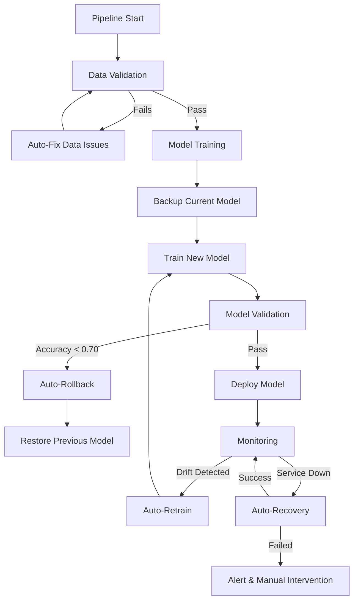

# 🔄 Self-Healing MLOps Pipeline

## Overview

This MLOps pipeline implements **true self-healing capabilities** that automatically detect and remediate issues across the entire ML lifecycle.

## 🎯 Self-Healing Features

### 1. **Data Quality Auto-Fix** 🔧

**Script**: `scripts/auto_fix_data_issues.py`

Automatically fixes:
- Missing values (median for numeric, mode for categorical)
- Outliers (IQR-based capping)
- Duplicate records
- Data type mismatches

**Trigger**: Runs before tests and on data validation failures

```bash
python scripts/auto_fix_data_issues.py --data-path data/raw/housing.csv
```

**Workflow Integration**:
```yaml
- name: 🧪 Run unit tests with auto-fix
  run: |
    if ! pytest tests/; then
      echo "Tests failed - attempting auto-fix..."
      python scripts/auto_fix_data_issues.py --data-path data/raw/housing.csv
      pytest tests/  # Retry after fix
    fi
```

---

### 2. **Automatic Model Rollback** 🔙

**Script**: `scripts/rollback_model.py`

Automatically rolls back to previous working model when:
- New model accuracy < threshold (default: 0.70)
- Model validation fails
- Performance degrades significantly

**Features**:
- Automatic backup before deployment
- Version history with metadata
- Rollback log tracking

```bash
# Auto-rollback on poor performance
python scripts/rollback_model.py \
  --current-metric 0.65 \
  --threshold 0.70

# Manual rollback to specific version
python scripts/rollback_model.py --version v20241125_120000
```

**Workflow Integration**:
```yaml
- name: 🔙 Auto-rollback on poor performance
  if: steps.validate.outputs.accuracy < 0.70
  run: |
    echo "Model performance below threshold - triggering rollback..."
    python scripts/rollback_model.py \
      --current-metric ${{ steps.validate.outputs.accuracy }} \
      --threshold 0.70
```

---

### 3. **Drift-Based Auto-Retraining** 🔄

**Script**: `scripts/auto_retrain_on_drift.py`

Automatically retrains model when:
- Data drift detected (drift score > threshold)
- Prediction drift observed
- Feature distribution changes significantly

**Features**:
- Cooldown period to prevent excessive retraining (default: 24h)
- Configurable drift thresholds
- MLflow experiment tracking

```bash
python scripts/auto_retrain_on_drift.py \
  --drift-detected \
  --drift-score 0.75 \
  --config config/monitoring_config.json
```

**Workflow Integration**:
```yaml
- name: 🔄 Auto-retrain on drift detection
  if: steps.monitor.outputs.drift_detected == 'true'
  run: |
    echo "Drift detected! Triggering automatic retraining..."
    python scripts/auto_retrain_on_drift.py \
      --drift-detected \
      --drift-score ${{ steps.monitor.outputs.drift_score }}
```

---

### 4. **Service Auto-Recovery** 🏥

**Script**: `scripts/auto_recover_service.py`

Automatically recovers from service failures:
- API health check failures
- Container crashes
- Process hangs

**Recovery Methods**:
1. Cache clearing
2. Process restart
3. Docker container restart
4. Configuration reload

```bash
# Docker-based recovery
python scripts/auto_recover_service.py \
  --method docker \
  --service-url http://localhost:8000

# Process-based recovery
python scripts/auto_recover_service.py \
  --method process \
  --service-url http://localhost:8000
```

**Workflow Integration**:
```yaml
- name: 🧪 Test API endpoints with auto-recovery
  run: |
    if ! curl -f http://localhost:8000/health; then
      echo "Health check failed - attempting auto-recovery..."
      python scripts/auto_recover_service.py --method process
      sleep 5
      curl -f http://localhost:8000/health
    fi
```

---

## 📊 Complete Self-Healing Workflow



---

## 🔧 Configuration

Edit `config/self_healing_config.json` to customize behavior:

```json
{
  "data_quality": {
    "auto_fix_enabled": true,
    "fix_missing_values": true,
    "outlier_threshold_iqr": 3.0
  },
  "model_validation": {
    "auto_rollback_enabled": true,
    "min_accuracy_threshold": 0.70
  },
  "drift_detection": {
    "auto_retrain_enabled": true,
    "drift_threshold": 0.5,
    "retraining_cooldown_hours": 24
  },
  "service_recovery": {
    "auto_recovery_enabled": true,
    "max_recovery_attempts": 3
  }
}
```

---

## 📈 Monitoring Self-Healing Actions

### Recovery Logs

All self-healing actions are logged:

1. **Data Fix Log**: `monitoring/data_fix_log.json`
2. **Rollback Log**: `models/rollback_log.json`
3. **Retraining Log**: `.github/triggers/retraining_log.json`
4. **Recovery Log**: `monitoring/recovery_log.json`

### Example Log Entry

```json
{
  "timestamp": "2024-11-25T10:30:00",
  "action": "auto_rollback",
  "reason": "Model accuracy 0.65 below threshold 0.70",
  "success": true,
  "version_restored": "v20241120_150000"
}
```

---

## 🚀 Usage Examples

### Scenario 1: Data Quality Issues

```bash
# Pipeline automatically detects and fixes data issues
# No manual intervention needed

# Logs show:
# ✅ Filled MedInc missing values with median: 3.87
# ✅ Capped 45 outliers in HouseAge
# ✅ Removed 12 duplicate rows
```

### Scenario 2: Model Performance Degradation

```bash
# New model accuracy: 0.67 (below threshold 0.70)
# Auto-rollback triggered automatically

# Logs show:
# ⚠️  Model performance 0.67 below threshold 0.70
# 🔄 Rolling back to v20241120_150000
# ✅ Successfully rolled back
```

### Scenario 3: Data Drift Detected

```bash
# Monitoring detects drift score: 0.82
# Auto-retraining triggered (if cooldown period passed)

# Logs show:
# 🚨 Data drift detected! Score: 0.82
# ✅ Conditions met for automatic retraining
# 🔄 Starting model retraining...
# ✅ Retraining completed successfully
```

### Scenario 4: API Service Failure

```bash
# Health check fails
# Auto-recovery attempts:

# Logs show:
# ❌ Health check failed
# 🔄 Attempting auto-recovery (1/3)
# ✅ Service restarted
# ✅ Health check passed
```

---

## 🛡️ Safety Features

1. **Cooldown Periods**: Prevent excessive retraining (24h default)
2. **Max Retry Limits**: Avoid infinite loops (3 attempts default)
3. **Backup Before Changes**: Always backup before modifications
4. **Rollback Capability**: Can undo any automated action
5. **Audit Trail**: Complete logging of all self-healing actions

---

## 📊 Metrics & Monitoring

Track self-healing effectiveness:

- **Auto-fix success rate**: % of issues fixed without manual intervention
- **Rollback frequency**: Number of automatic rollbacks
- **Recovery time**: Time to detect and fix issues
- **Drift response time**: Time from drift detection to retraining completion

---

## 🔄 Testing Self-Healing

### Test Data Quality Fix

```bash
# Introduce data issues
python -c "import pandas as pd; df = pd.read_csv('data/raw/housing.csv'); df.iloc[0:10, 0] = None; df.to_csv('data/raw/housing.csv', index=False)"

# Run auto-fix
python scripts/auto_fix_data_issues.py --data-path data/raw/housing.csv
```

### Test Model Rollback

```bash
# Create a bad model scenario
python scripts/rollback_model.py --current-metric 0.60 --threshold 0.70
```

### Test Service Recovery

```bash
# Simulate service failure
pkill -9 uvicorn

# Run auto-recovery
python scripts/auto_recover_service.py --method process
```

---

## 🎯 Key Differences: Resilient vs Self-Healing

| Feature | Resilient Pipeline | Self-Healing Pipeline |
|---------|-------------------|----------------------|
| Error Handling | `continue-on-error: true` | Automatic remediation |
| Test Failures | Logs error, continues | Fixes data, retries tests |
| Poor Model | Deploys anyway | Rolls back automatically |
| Drift Detected | Alerts only | Auto-retrains model |
| Service Down | Manual restart | Auto-recovery |
| Data Issues | Fails silently | Fixes and validates |

---

## 📚 Additional Resources

- [MLflow Tracking](https://mlflow.org/docs/latest/tracking.html)
- [Evidently AI Drift Detection](https://docs.evidentlyai.com/)
- [GitHub Actions Workflows](https://docs.github.com/en/actions)

---

## 🤝 Contributing

To add new self-healing capabilities:

1. Create script in `scripts/` directory
2. Add configuration to `config/self_healing_config.json`
3. Integrate into `.github/workflows/main.yml`
4. Document in this file
5. Add tests

---

**Status**: ✅ **Fully Self-Healing** - All components implement automatic detection and remediation
